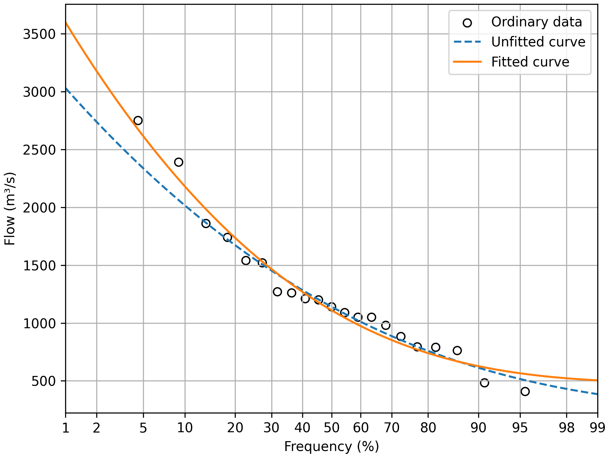
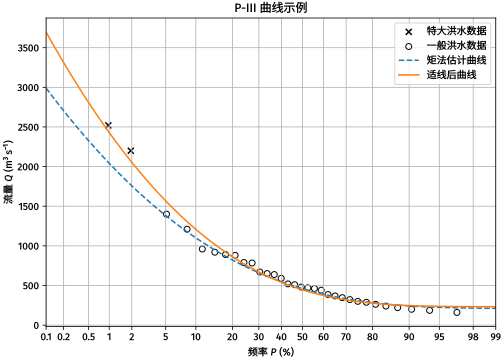

# `pearson3curve`: Pearson Type III Curve Fitting and Plotting

`pearson3curve` is a Python package for curve fitting and plotting of data
points which follow the Pearson type III (P-III) distribution. It is useful in
hydrologic frequency analysis and hydraulic calculations.

Notice: This package is the brand new version of the old `Pearson3CurveFitting`
package. For the old version, please refer to the
[archived repository](https://github.com/tanukihee/Pearson3CurveFittingArchive).

## Examples

### Successive Data

See [Successive Data Example](./example/successive.py) for the code.

Figure example:

### Non-Successive Data

See [Non-Successive Data Example](./example/nonsuccessive.py) for the code.

Figure example in Chinese, using pgf backend for better multi-language text and
math typesetting support:

## Usages

See [API Documentation](./docs/api.md) for details.

## Development

This package uses `pdm` for package management. For detailed usages, please
refer to the [pdm documentation](https://pdm-project.org/en/latest/).

---

Copyright (c) 2020 -- 2024 ListLee
